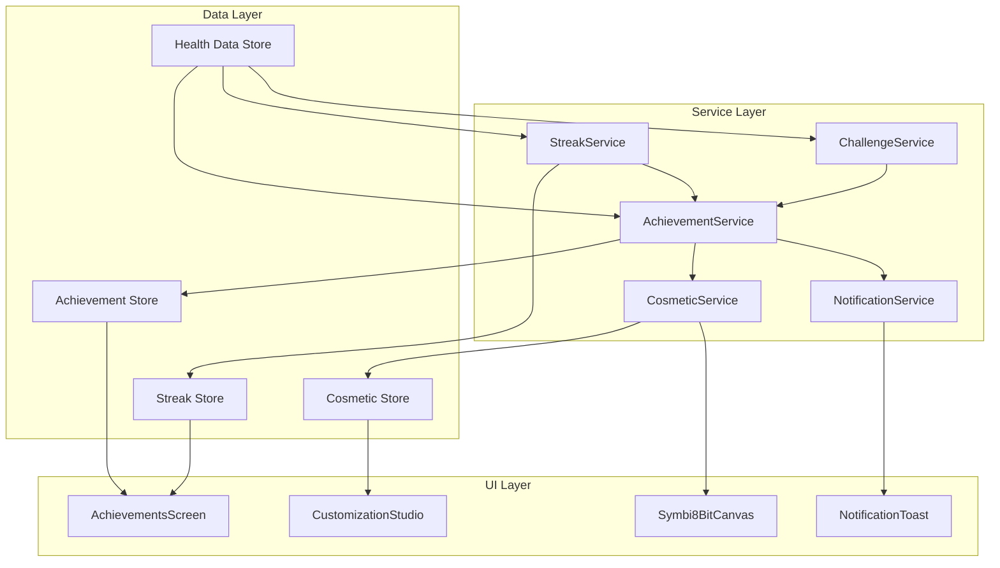

# Design Document: Achievement & Streak System with Customization Studio

## Overview

The Achievement & Streak System introduces gamification elements to Symbi, rewarding users for consistent health engagement through badges, streaks, challenges, and unlockable cosmetics. The Customization Studio provides an interface for users to preview and equip earned cosmetics on their Symbi.

This system integrates with the existing health data flow, evolution system, and storage infrastructure while adding new services for achievement tracking, streak management, challenge generation, and cosmetic rendering.

## Architecture



## Components and Interfaces

### Services

#### AchievementService

Manages achievement definitions, progress tracking, and unlock logic.

```typescript
interface AchievementService {
  // Core operations
  checkMilestone(healthData: HealthMetrics): Promise<Achievement[]>;
  unlockAchievement(achievementId: string): Promise<AchievementUnlockResult>;
  getAchievementProgress(achievementId: string): AchievementProgress;

  // Queries
  getAllAchievements(): Achievement[];
  getEarnedAchievements(): Achievement[];
  getAchievementsByCategory(category: AchievementCategory): Achievement[];

  // Statistics
  getStatistics(): AchievementStatistics;
  getCompletionPercentage(): number;
}
```

#### StreakService

Tracks daily streaks and milestone achievements.

```typescript
interface StreakService {
  // Core operations
  recordDailyProgress(date: string, metCriteria: boolean): Promise<StreakUpdate>;
  getCurrentStreak(): number;
  getLongestStreak(): number;

  // Milestone tracking
  getNextMilestone(): StreakMilestone;
  getDaysUntilMilestone(): number;
  checkMilestoneReached(): StreakMilestone | null;

  // Recovery
  recoverFromCorruption(): Promise<StreakState>;
}
```

#### ChallengeService

Generates and tracks weekly challenges.

```typescript
interface ChallengeService {
  // Challenge management
  generateWeeklyChallenges(healthHistory: HealthDataCache[]): Challenge[];
  updateChallengeProgress(challengeId: string, progress: number): Promise<void>;
  completeChallenge(challengeId: string): Promise<ChallengeReward>;

  // Queries
  getActiveChallenges(): Challenge[];
  getTimeRemaining(): number;
  checkAllCompleted(): boolean;
}
```

#### CosmeticService

Manages cosmetic inventory and equipped items.

```typescript
interface CosmeticService {
  // Inventory management
  addToInventory(cosmetic: Cosmetic): Promise<void>;
  getInventory(): CosmeticInventory;
  getByCategory(category: CosmeticCategory): Cosmetic[];

  // Equipment
  equipCosmetic(cosmeticId: string): Promise<void>;
  unequipCosmetic(cosmeticId: string): Promise<void>;
  getEquippedCosmetics(): EquippedCosmetics;

  // Rendering
  getCosmeticLayers(): CosmeticLayer[];
  getPreviewRender(cosmeticId: string): CosmeticRenderData;
}
```

### UI Components

#### AchievementsScreen

Displays achievement progress, earned badges, and statistics.

#### CustomizationStudio

Full-screen interface for previewing and equipping cosmetics with category tabs and real-time Symbi preview.

#### CosmeticRenderer

Extends Symbi8BitCanvas to render equipped cosmetics in correct layer order.

#### NotificationToast

Queued notification system for achievement unlocks and celebrations.

## Data Models

### Achievement Types

```typescript
type AchievementCategory =
  | 'health_milestones'
  | 'streak_rewards'
  | 'challenge_completion'
  | 'exploration'
  | 'special_events';

type RarityTier = 'common' | 'rare' | 'epic' | 'legendary';

interface Achievement {
  id: string;
  name: string;
  description: string;
  category: AchievementCategory;
  rarity: RarityTier;
  iconUrl: string;
  unlockCondition: UnlockCondition;
  cosmeticRewards: string[]; // cosmetic IDs
  unlockedAt?: Date;
  progress?: AchievementProgress;
}

interface AchievementProgress {
  current: number;
  target: number;
  percentage: number;
}

interface UnlockCondition {
  type: 'steps' | 'streak' | 'challenge' | 'evolution' | 'custom';
  threshold: number;
  comparison: 'gte' | 'eq' | 'consecutive';
}

interface AchievementStatistics {
  totalEarned: number;
  totalAvailable: number;
  completionPercentage: number;
  rarestBadge: Achievement | null;
  recentUnlocks: Achievement[];
}
```

### Streak Types

```typescript
interface StreakState {
  currentStreak: number;
  longestStreak: number;
  lastRecordedDate: string;
  streakHistory: StreakRecord[];
}

interface StreakRecord {
  date: string;
  metCriteria: boolean;
  streakCount: number;
}

interface StreakMilestone {
  days: number;
  achievementId: string;
  cosmeticReward?: string;
}

const STREAK_MILESTONES: StreakMilestone[] = [
  { days: 7, achievementId: 'streak_7' },
  { days: 14, achievementId: 'streak_14' },
  { days: 30, achievementId: 'streak_30' },
  { days: 60, achievementId: 'streak_60' },
  { days: 90, achievementId: 'streak_90' },
];
```

### Challenge Types

```typescript
interface Challenge {
  id: string;
  title: string;
  description: string;
  objective: ChallengeObjective;
  reward: ChallengeReward;
  startDate: string;
  endDate: string;
  progress: number;
  completed: boolean;
}

interface ChallengeObjective {
  type: 'steps' | 'sleep' | 'hrv' | 'streak' | 'combined';
  target: number;
  unit: string;
}

interface ChallengeReward {
  achievementId?: string;
  cosmeticId?: string;
  bonusXP?: number;
}
```

### Cosmetic Types

```typescript
type CosmeticCategory = 'hat' | 'accessory' | 'color' | 'background' | 'theme';

interface Cosmetic {
  id: string;
  name: string;
  category: CosmeticCategory;
  rarity: RarityTier;
  previewUrl: string;
  renderData: CosmeticRenderData;
  unlockCondition: string; // achievement ID or special condition
  unlockedAt?: Date;
  sourceAchievement?: string;
}

interface CosmeticRenderData {
  layerIndex: number; // z-order for rendering
  pixels?: PixelData[]; // for 8-bit style cosmetics
  offsetX: number;
  offsetY: number;
  colorOverride?: string; // for color variations
}

interface PixelData {
  x: number;
  y: number;
  color: string;
}

interface EquippedCosmetics {
  hat?: string;
  accessory?: string;
  color?: string;
  background?: string;
  theme?: string;
}

interface CosmeticInventory {
  items: Cosmetic[];
  equipped: EquippedCosmetics;
  lastUpdated: Date;
}
```

### Storage Schema

```typescript
interface AchievementStorageData {
  achievements: Achievement[];
  statistics: AchievementStatistics;
  lastUpdated: string;
}

interface StreakStorageData {
  state: StreakState;
  lastUpdated: string;
}

interface ChallengeStorageData {
  activeChallenges: Challenge[];
  completedChallenges: string[];
  weekStartDate: string;
}

interface CosmeticStorageData {
  inventory: CosmeticInventory;
  lastUpdated: string;
}
```

## Correctness Properties

_A property is a characteristic or behavior that should hold true across all valid executions of a system-essentially, a formal statement about what the system should do. Properties serve as the bridge between human-readable specifications and machine-verifiable correctness guarantees._

### Property 1: Achievement data round-trip consistency

_For any_ valid achievement data, serializing to JSON and then parsing back SHALL produce an equivalent achievement object with all fields preserved.
**Validates: Requirements 1.5, 1.6**

### Property 2: Milestone detection correctness

_For any_ health metrics and milestone threshold, when the metrics meet or exceed the threshold, the achievement system SHALL detect and record the milestone.
**Validates: Requirements 1.1**

### Property 3: Achievement progress calculation

_For any_ incomplete achievement with defined criteria, the progress percentage SHALL equal (current / target) \* 100, and remaining criteria SHALL equal (target - current).
**Validates: Requirements 1.4**

### Property 4: Streak increment on criteria met

_For any_ streak state where daily criteria is met, recording progress SHALL increment the streak counter by exactly 1.
**Validates: Requirements 2.1**

### Property 5: Streak reset on criteria missed

_For any_ streak state where daily criteria is not met, recording progress SHALL reset the streak counter to zero.
**Validates: Requirements 2.2**

### Property 6: Streak milestone triggers achievement

_For any_ streak reaching a milestone threshold (7, 14, 30, 60, 90), the corresponding achievement SHALL be unlocked.
**Validates: Requirements 2.3**

### Property 7: Challenge progress updates correctly

_For any_ active challenge and health data update, the challenge progress SHALL reflect the cumulative progress toward the objective.
**Validates: Requirements 3.2, 3.5**

### Property 8: Cosmetic data round-trip consistency

_For any_ valid cosmetic inventory, serializing to JSON and then parsing back SHALL produce an equivalent inventory with all items, equipped status, and metadata preserved.
**Validates: Requirements 4.3, 4.4**

### Property 9: Cosmetic unlock adds to inventory

_For any_ achievement with cosmetic rewards, unlocking the achievement SHALL add all associated cosmetics to the user's inventory.
**Validates: Requirements 4.1**

### Property 10: Cosmetic layer ordering

_For any_ set of equipped cosmetics, the render layers SHALL be ordered by layerIndex in ascending order (background < color < accessory < hat).
**Validates: Requirements 5.5**

### Property 11: Equipped cosmetics persistence

_For any_ cosmetic equip action, the selection SHALL persist to storage and be restored on application load.
**Validates: Requirements 5.3, 6.2**

### Property 12: Achievement filter correctness

_For any_ filter criteria (category, status, rarity), the filtered results SHALL contain only achievements matching all specified criteria.
**Validates: Requirements 7.3**

### Property 13: Statistics calculation accuracy

_For any_ set of achievements, the completion percentage SHALL equal (earned count / total count) \* 100.
**Validates: Requirements 7.1, 7.4**

### Property 14: Notification queue ordering

_For any_ sequence of achievement notifications, they SHALL be displayed in the order they were triggered.
**Validates: Requirements 8.4**

### Property 15: Notification suppression with recording

_For any_ achievement earned when notifications are disabled, the achievement SHALL be recorded but no visual notification SHALL be displayed.
**Validates: Requirements 8.5**

## Error Handling

### Storage Errors

- **Read failures**: Return default empty state, log error via ErrorReportingService
- **Write failures**: Retry up to 3 times with exponential backoff, queue for later sync
- **Corruption detection**: Validate schema on load, recover to last known good state

### Achievement Errors

- **Invalid milestone data**: Skip processing, log warning
- **Duplicate unlock attempts**: Idempotent operation, return existing achievement
- **Missing cosmetic rewards**: Log error, unlock achievement without cosmetics

### Streak Errors

- **Date parsing errors**: Use current date as fallback
- **Corrupted streak data**: Reset to zero with user notification
- **Missing history entries**: Reconstruct from available data

### Rendering Errors

- **Missing cosmetic assets**: Fall back to default appearance
- **Invalid layer data**: Skip cosmetic, render base Symbi
- **Performance degradation**: Reduce cosmetic complexity dynamically

## Testing Strategy

### Property-Based Testing

The project will use **fast-check** as the property-based testing library for TypeScript/JavaScript.

Each property-based test MUST:

1. Be tagged with a comment referencing the correctness property: `**Feature: achievement-streak-system, Property {number}: {property_text}**`
2. Run a minimum of 100 iterations
3. Use smart generators that constrain to valid input spaces

### Unit Testing

Unit tests will cover:

- Individual service method behavior
- Edge cases (empty data, boundary values)
- Error handling paths
- UI component rendering

### Integration Testing

Integration tests will verify:

- Achievement → Cosmetic unlock flow
- Streak → Achievement trigger flow
- Challenge completion → Reward distribution
- Storage persistence across sessions

### Test File Organization

```
src/services/__tests__/
  AchievementService.test.ts
  AchievementService.property.test.ts
  StreakService.test.ts
  StreakService.property.test.ts
  ChallengeService.test.ts
  CosmeticService.test.ts
  CosmeticService.property.test.ts

src/components/__tests__/
  CustomizationStudio.test.tsx
  CosmeticRenderer.test.tsx
  NotificationToast.test.tsx
```
