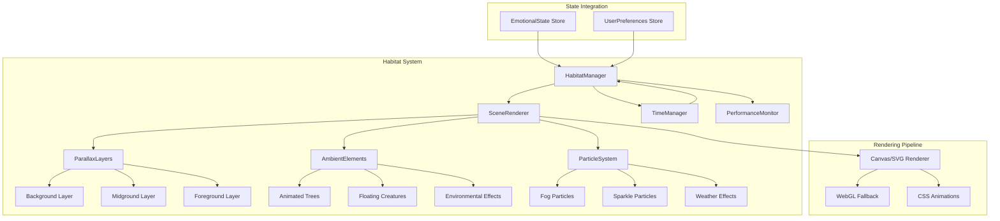

# Design Document

## Overview

The Interactive Symbi Habitat feature introduces a dynamic, layered animation system that renders beautiful Halloween-themed environments behind the Symbi character. The system uses a composable architecture with parallax scrolling, particle effects, and state-driven scene management to create an immersive experience that responds to emotional states and time of day.

The implementation leverages React Native's Animated API for smooth 60 FPS animations, with web-optimized CSS transforms and requestAnimationFrame for particle systems. The architecture prioritizes performance through lazy loading, adaptive quality settings, and intelligent resource management.

## Architecture



## Components and Interfaces

### HabitatManager

The central orchestrator that coordinates scene rendering, state transitions, and performance optimization.

```typescript
interface HabitatManagerProps {
  emotionalState: EmotionalState;
  isVisible: boolean;
  onInteraction?: (point: { x: number; y: number }) => void;
  reducedMotion?: boolean;
}

interface HabitatConfig {
  scene: SceneType;
  timePhase: TimePhase;
  emotionalState: EmotionalState;
  quality: QualityLevel;
}
```

### SceneRenderer

Renders the complete scene with all layers and manages transitions.

```typescript
interface SceneRendererProps {
  config: HabitatConfig;
  dimensions: { width: number; height: number };
  onTransitionComplete?: () => void;
}

type SceneType = 'haunted-forest' | 'moonlit-graveyard' | 'spooky-mansion';
type TimePhase = 'dawn' | 'day' | 'dusk' | 'night';
type QualityLevel = 'low' | 'medium' | 'high';
```

### ParallaxLayer

Individual depth layer with independent scroll speed.

```typescript
interface ParallaxLayerProps {
  depth: number; // 0-1, affects parallax speed
  children: React.ReactNode;
  offsetX?: Animated.Value;
  offsetY?: Animated.Value;
}
```

### AmbientElement

Animated decorative element within the scene.

```typescript
interface AmbientElementProps {
  type: AmbientElementType;
  position: { x: number; y: number };
  scale?: number;
  animationDelay?: number;
  emotionalModifier?: EmotionalState;
}

type AmbientElementType =
  | 'tree'
  | 'tombstone'
  | 'fence'
  | 'mansion'
  | 'bat'
  | 'owl'
  | 'wisp'
  | 'firefly'
  | 'leaf'
  | 'candle'
  | 'moon'
  | 'star';
```

### ParticleSystem

Manages particle generation and animation.

```typescript
interface ParticleSystemProps {
  type: ParticleType;
  emissionRate: number;
  maxParticles: number;
  bounds: { width: number; height: number };
  emotionalState: EmotionalState;
}

type ParticleType = 'fog' | 'sparkle' | 'rain' | 'leaves' | 'fireflies' | 'dust';

interface Particle {
  id: string;
  x: number;
  y: number;
  vx: number;
  vy: number;
  life: number;
  maxLife: number;
  size: number;
  opacity: number;
  color: string;
}
```

### TimeManager

Determines current time phase and manages time-based transitions.

```typescript
interface TimeManagerConfig {
  updateInterval: number; // ms between time checks
  transitionDuration: number; // ms for phase transitions
}

interface TimePhaseConfig {
  phase: TimePhase;
  startHour: number;
  endHour: number;
  colors: TimePhaseColors;
}

interface TimePhaseColors {
  skyGradient: string[];
  ambientLight: string;
  accentColor: string;
  particleColor: string;
}
```

### PerformanceMonitor

Monitors frame rate and adjusts quality dynamically.

```typescript
interface PerformanceMetrics {
  fps: number;
  frameTime: number;
  particleCount: number;
  memoryUsage?: number;
}

interface QualitySettings {
  particleMultiplier: number;
  parallaxLayers: number;
  ambientElementCount: number;
  enableBlur: boolean;
  enableShadows: boolean;
}
```

## Data Models

### Scene Configuration

```typescript
interface SceneDefinition {
  id: SceneType;
  name: string;
  layers: LayerDefinition[];
  ambientElements: AmbientElementDefinition[];
  particles: ParticleConfig[];
  emotionalOverrides: Record<EmotionalState, SceneModifiers>;
}

interface LayerDefinition {
  depth: number;
  elements: LayerElement[];
  parallaxSpeed: number;
}

interface LayerElement {
  type: 'gradient' | 'svg' | 'image';
  content: string;
  position: Position;
  animation?: AnimationConfig;
}

interface SceneModifiers {
  colorShift: number; // -1 to 1
  brightness: number; // 0 to 2
  particleSpeed: number; // multiplier
  ambientIntensity: number; // 0 to 1
}
```

### Habitat State

```typescript
interface HabitatState {
  currentScene: SceneType;
  timePhase: TimePhase;
  emotionalState: EmotionalState;
  isTransitioning: boolean;
  quality: QualityLevel;
  interactionEffects: InteractionEffect[];
}

interface InteractionEffect {
  id: string;
  type: 'ripple' | 'burst' | 'glow';
  position: { x: number; y: number };
  startTime: number;
  duration: number;
}
```

## Correctness Properties

_A property is a characteristic or behavior that should hold true across all valid executions of a system-essentially, a formal statement about what the system should do. Properties serve as the bridge between human-readable specifications and machine-verifiable correctness guarantees._

Based on the acceptance criteria analysis, the following correctness properties must be validated:

### Property 1: Parallax Layer Count

_For any_ scene configuration and quality level (medium or high), the rendered habitat SHALL contain at least 3 parallax layers to create proper depth perception.

**Validates: Requirements 1.2**

### Property 2: Ambient Element Minimum Count

_For any_ scene type (haunted-forest, moonlit-graveyard, spooky-mansion), the scene definition SHALL include at least 5 ambient elements to ensure visual richness.

**Validates: Requirements 1.4**

### Property 3: Emotional State Scene Modifiers

_For any_ emotional state, the getSceneModifiers function SHALL return appropriate modifier values where:

- SAD state returns brightness < 0.7 and particleSpeed < 0.8
- ACTIVE or VIBRANT states return brightness > 1.0 and particleSpeed > 1.2
- CALM or RESTED states return brightness between 0.8-1.0 and particleSpeed between 0.6-0.9
- STRESSED or ANXIOUS states return ambientIntensity > 1.0

**Validates: Requirements 2.2, 2.3, 2.4**

### Property 4: Time Phase Calculation

_For any_ hour value (0-23), the getTimePhase function SHALL return the correct time phase:

- Hours 5-7 return 'dawn'
- Hours 8-16 return 'day'
- Hours 17-19 return 'dusk'
- Hours 20-23 or 0-4 return 'night'

**Validates: Requirements 3.1**

### Property 5: Color Palette Validation

_For any_ scene configuration, all primary colors used in the scene (sky gradient, ambient light, accent colors) SHALL be derived from or harmonious with the HALLOWEEN_COLORS palette defined in theme.ts.

**Validates: Requirements 5.5**

### Property 6: Quality Settings Constraints

_For any_ quality level, the getQualitySettings function SHALL return appropriate constraints:

- 'low' quality: particleMultiplier = 0.5, parallaxLayers <= 2, enableBlur = false
- 'medium' quality: particleMultiplier = 0.75, parallaxLayers = 3, enableBlur = true
- 'high' quality: particleMultiplier = 1.0, parallaxLayers >= 3, enableBlur = true
- When reducedMotion is true: particleMultiplier = 0, regardless of quality level

**Validates: Requirements 6.1, 6.3, 6.4**

### Property 7: Interaction Effect Position

_For any_ click/tap interaction at position (x, y) within the habitat bounds, the created interaction effect SHALL have its position property set to the same (x, y) coordinates.

**Validates: Requirements 7.1**

### Property 8: Scene Preference Persistence Round-Trip

_For any_ valid scene type, saving the scene preference and then loading it SHALL return the same scene type that was saved.

**Validates: Requirements 8.1, 8.2**

## Error Handling

### Scene Loading Errors

- If a scene definition fails to load, fall back to a minimal gradient background
- Log error to ErrorReportingService with scene type context
- Display habitat with reduced visual elements rather than showing error state

### Animation Errors

- If requestAnimationFrame fails, fall back to CSS animations
- If particle system exceeds memory limits, reduce particle count dynamically
- Catch and suppress individual particle errors to prevent cascade failures

### Storage Errors

- If localStorage is unavailable, use in-memory storage for session
- If preference read fails, use default scene (Haunted Forest)
- If preference write fails, continue without persistence and log warning

### Performance Degradation

- If FPS drops below 30 for 5 consecutive seconds, automatically reduce quality level
- If device reports low battery, switch to 'low' quality mode
- If memory usage exceeds threshold, clear particle pools and reduce ambient elements

### Browser Compatibility

- If WebGL is unavailable, use Canvas 2D rendering
- If Canvas is unavailable, use CSS-only animations with static backgrounds
- If Animated API fails on web, fall back to CSS transitions

## Testing Strategy

### Dual Testing Approach

This feature requires both unit tests and property-based tests to ensure correctness:

- **Unit tests** verify specific examples, edge cases, and integration points
- **Property-based tests** verify universal properties that should hold across all inputs

### Property-Based Testing Framework

The implementation will use **fast-check** as the property-based testing library for TypeScript/JavaScript. Each property test should run a minimum of 100 iterations.

### Unit Tests

Unit tests will cover:

1. **SceneRenderer Component**
   - Renders correct scene type
   - Applies emotional state modifiers
   - Handles missing scene definitions gracefully

2. **TimeManager**
   - Returns correct time phase for boundary hours (5am, 8am, 5pm, 8pm)
   - Handles timezone edge cases
   - Triggers transitions at phase boundaries

3. **ParticleSystem**
   - Creates particles within bounds
   - Removes expired particles
   - Respects max particle limits

4. **PerformanceMonitor**
   - Detects low FPS correctly
   - Triggers quality reduction at threshold
   - Restores quality when performance improves

5. **HabitatPreferences**
   - Saves and loads scene preference
   - Handles storage errors gracefully
   - Returns default when no preference exists

### Property-Based Tests

Each correctness property will be implemented as a property-based test:

1. **Property 1 Test**: Generate random scene configs, verify layer count >= 3
2. **Property 2 Test**: Generate random scene types, verify ambient element count >= 5
3. **Property 3 Test**: Generate random emotional states, verify modifier constraints
4. **Property 4 Test**: Generate random hours (0-23), verify correct time phase
5. **Property 5 Test**: Generate scene configs, verify all colors match palette
6. **Property 6 Test**: Generate quality levels and reducedMotion flags, verify settings
7. **Property 7 Test**: Generate random (x, y) positions, verify effect position matches
8. **Property 8 Test**: Generate random scene types, verify save/load round-trip

### Test Annotations

All property-based tests must include the following annotation format:

```typescript
/**
 * **Feature: interactive-symbi-habitat, Property {number}: {property_text}**
 * **Validates: Requirements X.Y**
 */
```

### Integration Tests

Integration tests will verify:

1. Habitat renders correctly within MainScreen
2. Emotional state changes trigger scene transitions
3. Time phase changes update scene lighting
4. User interactions create appropriate effects
5. Quality settings apply correctly based on device capabilities
